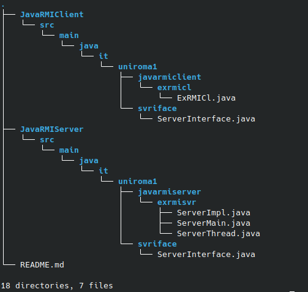
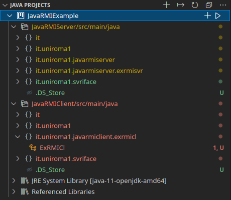

# JavaRMI Example
 Simple client-server application using JavaRMI (Remote Method Invocation) for the *midlleware* level.

 Using middleware allows to avoid socket-level code: this code will be automatically generated from the middleware infrastructure.

 When using a middleware it is useful to start from the *IDL (Interface Definition Language)* to design the interface of the server. In JavaRMI this language is Java itself, deputed for designed interfaces.

 When working with middleware the interface should be *shared between the server and the client*. In JavaRMI the interface file should be *exactly the same also in the same package path*.

 The server interface is into the `svriface` package.

 This is the *directory tree* of the project:

 

 This is how the *JAVA PROJECTS* section in VisualStudioCode should appear:

 

## Server
No network management and socket programming, because it is all done by the middleware.

### Interface ServerInterface
Full path: _JavaRMIExample/JavaRMIServer/src/main/java/it/uniroma1/svriface/ServerInterface.java_

The implemented server is the same as `SocketExample`: the operations are `startTask()`, `isReady()` that takes an int _id_ in input and returns a boolean, `getResults()` that takes an int _id_ in input and returns an array of integers.

This interface is very similar to the one implemented in `SocketExample`, what is different is that those functions require an _id_ value to create the context of interaction between the client and the server, when in `SocketExample` that context was created by the socket level.

This value _id_ is like a client number that the server takes to manage the client with a specific identification code.

### Class ServerImpl
Full path: _JavaRMIExample/JavaRMIServer/src/main/java/it/uniroma1/javarmiserver/exrmisvr/ServerImpl.java_

This is the Server RMI in Java. Here the focus is only on the *application logic*.

The Hashtable `threadPool`, useful for maintain the context through the _id_, that is used as *key* for the Hashtable.

The *constructor* creates the Hashtable with zero threads inside, means that at start the server serves no clients.

Then there are the implementations of the interface:
- The `startTask()` prints that the server has a new client as requested, creates a new _ServerThread_ thread and puts it into the Hashtable in position _allocatedThreads_. Then runs the thread and increments the value of _allocatedThreads_ to allocate a new thread.
- `isReady()` simply returns the status of the server.
- `getResults()` returns the resources produced by the thread. Notice that the interface returns an array of integers and differently from `SocketExample` here is the middleware that decides how to *marshall* and *serialize* the information. 

### Class ServerThread
Full path: _/JavaRMIExample/JavaRMIServer/src/main/java/it/uniroma1/javarmiserver/exrmisvr/ServerThread.java_

This class is exactly the same as in `SocketExample`.

### Class ServerMain
Full path: _JavaRMIExample/JavaRMIServer/src/main/java/it/uniroma1/javarmiserver/exrmisvr/ServerMain.java_

A `ServerImpl` object here is created.

An object `ServerInterface` called _stub_ is created. This is strictly related to RMI. This instruction tells to the system to dynamically create the STUB at runtime in order to manage the requests. In the STUB lives the network level code.

In RMI exists an operation `createRegistry()` for the static class `LocateRegistry`. Here the registry is created on port 5555.

Then the connection is created: *run* _ServerMain_ to start the server. No additional parameters are required.

## Client
The client can generate its own version of the network level code starting from the interface, that is shared between the server and the client itself.

The client is *completely unaware* of what happens into the network, exception done for the registry lookup and the stub obtainement.

### Interface ServerInterface
Full path: _JavaRMIExample/JavaRMIClient/src/main/java/it/uniroma1/svriface/ServerInterface.java_

Since the interface is shared between the client and the server, the exact same ServerInterface file will be on the client side.

In JavaRMI the interface file should be *exactly the same also in the same package path*.

### Class ExRMICl
Full path: _JavaRMIExample/JavaRMIClient/src/main/java/it/uniroma1/javarmiclient/exrmicl/ExRMICl.java_

The client just needs to connect to the server.

First of all it *connects to thre registry*. In this case the registry is running on _localhost_ at port _5555_. Of course the client should know the naming of directory service.

Then the client looks for the symbolic name into the registry (here 'Server' is chosen) and so achieves the `ServerInterface` stub. The stub is automatically generated at runtime when looking for the name.

Now the client is able to infoke the wanted methods.

*Run* _ExRMICl_ to start the client. No additional parameters are required.

## How to run
Run the `ServerMain` located at: _JavaRMIExample/JavaRMIServer/src/main/java/it/uniroma1/javarmiserver/exrmisvr/ServerMain.java_

Run the `ExRMICl` client located at: _JavaRMIExample/JavaRMIClient/src/main/java/it/uniroma1/javarmiclient/exrmicl/ExRMICl.java_. You can run as many clients you want.