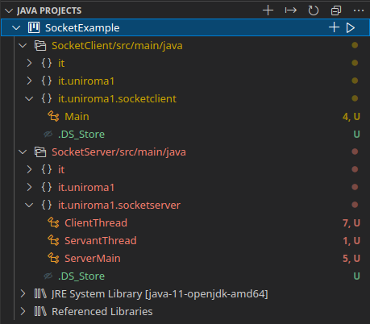

# SocketExample description
This project contains a basic example of a client-server communication using sockets.

On VisualStudioCode the launch settings are stored in the [launch.json](launch.json) file in this folder. The important is to pass the right arguments (as follows).

This is the **directory tree** of the project:

This is how the **JAVA PROJECTS** section in VisualStudioCode should appear:

## Server Side
Full Path: _SocketExample/SocketServer/src/main/java/it/uniroma1/socketserver_

Args needed to run the main: "8080"

Class `ServerMain` runs a server that accepts connections on port 8080 throught a socket.

When a client connects, the connection is accepted and the server generates a thread named `ClientThread` to manage the connection with the client. The `ClientThread` opens a new thread called `ServantThread` that has the role to produce the resources.

Once `ServerThread` finishes sets its status to `running=false`, `ClientThread` receives this information when asks for the status and then retrieves the produced resources, to it passes them to the client through the socket.

## Client Side
Full Path: _SocketExample/SocketClient/src/main/java/it/uniroma1/socketclient_

Args needed to run the main: ["127.0.0.1", "8080"]

Class `Main` runs a client that tries to connect to the specified address at the specified port.

Once connected, the client sends some commands such as _getStatus_ and _getResult_ to receive the information.

## How to run
Run `ServerMain` in server side with args: "8080"
Run `Main` in client side with args: "127.0.0.1", "8080"
