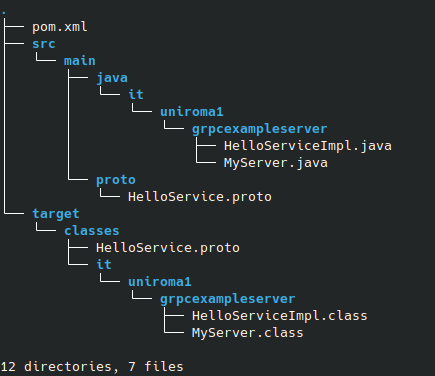
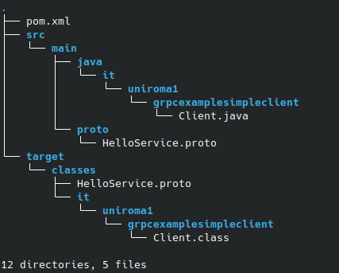
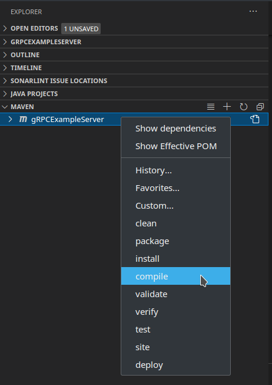

# gRPC Example 
[gRPC Reference Site](https://grpc.io/)

[Maven tutorial](https://www.baeldung.com/maven) for the **precompilation** (Follow the tutorial and/or the How To Run instructions below)

gRPC is the equivalent of JavaRMI for developing with **Remote Procedure Calls**, with the difference that in gRPC it is used to do a **precompilation** to generate the STUB (the Skeleton on the Server Side) and the Skeleton (STUB on the Client Side).

In JavaRMI the generation of the STUB and the Skeleton is done dinamically at runtime.

gRPC is a Remote Procedure Call system originally developed by Google and it is used to build **distributed system** using microservices.

Here the server is developed in Java and the clients are built both in Java and in Python as an exercise to appreciate the power of a middleware that uses Remote Procedure Calls.

When having a socket it happens that the socket sends a stream of bytes from side to side among the communicators: this means that it can be potentially absolutely network independent and this allow to have for example the two sides of the socket written in different languages. 

The only aspect in which the two different languages should be coherent is the way how they do the **marshalling** and the **serializing**, the processes for defining a format for transforming information (e.g. representation in big or little endian or some other rules). Once the communication rules are shared among the parties it is easier to have those parties in different languages.

When using a middleware the ends of the communication are generated not by writing the code at socket level, but by having the code generated by a **precompilation process**.

In gRPC the Interface Definition Language (IDL) is called **proto** that defines the Remote Procedure Calls in a _.proto_ file.

## Server
The concept is that the **interface** is defined in a language indipendent way into the **.proto** file, then in order to **implement** this interface into the server, the `HelloService.proto` must be included into the project and so the server can be written in the wanted language.

In Java it is needed to implement a class, that is `HelloServiceImpl` that extends `HelloServiceImplBase`.

This is the **directory tree** of the server project _before_ the Maven precompilation:

### Proto File
Full path: _gRPCExample/gRPCExampleServer/src/main/proto/HelloService.proto_ 

The first instruction says which is the version of proto we are using.

The keyword `option` gives directives to the precompiler and tells that the STUB and the Skeleton that will be generated should be in `java_multiple_files`. When doing the precompiling a lot of classes will be generated.

Then the `package` of the IDL is specified. It **should be the same** in every terminal we are using.

Then the services are the set of functionalities we are exporting.

The service `HelloRequest` consists on two fields: `firstName` and `lastName` of type string. In proto **it is mandatory** to give an integer number to each field of the message. Here we see that the id of `firstName` is 1 and the id of `lastName` is 2. It is similar for the `HelloResponse`. We call the two messages _input message_ and _output message_. They can have multiple return types, and it is responsability of the precompiler how to have multiple return types in the specific language.

The service `HelloService` offers one functionality represented by the keyword `rpc`, a Remote Procedure Call named `hello` that takes in input a message `HelloRequest` and returns an output message that is `HelloResponse`. This is de signature of the **remote module**, and this module consists in one Remote Procedure Call.

So the conceptual model of the interface is that you have modules, that are called services; each module consists in one or more RPCs; each RPC consists in one input message and one output message; each message can have one or more fields.

### Class HelloServiceImpl
Full path: _gRPCExample/gRPCExampleServer/src/main/java/it/uniroma1/grpcexampleserver/HelloServiceImpl.java_

Once defined the interface you have to define your implementation in the language you want to implement the server.

The class `HelloServiceImpl` extends the class `HelloServiceImplBase`: this new class is the STUB that is generated by the precompiler. This class stays in the _Generated Sources_ by the precompiler.

Only one method has to be implemented, and it is `hello`, that is the only RPC in the service `HelloService` in the _.proto_ file. The method `hello` always returns `void`.

Tipically it is composed by an object `request`, now of type `HelloRequest`, and by a `responseObserver`, that is a `StreamObserver<HelloResponse>`. These objects are recognized by the definition of the _.proto_ file.

Why the object `StreamObserver<HelloResponse>`? When in distributed systems you are not sure when the client is able to get the results, the infrastructure works by returning an **Observer**. An Observer is an object pointed by an observed object and when the observed object is subject to a modification it calls a callback method that warns the Observer (like the _listener_ in javascript). The `responseObserver` is observed by the proxy on the client side and when the server makes the request ready a signal to the client is sent and the client sees the response.

The `greeting` string is simply a string that will be sent to the client through the `response`, built using the `newBuilder()` method of the class `HelloResponse` and the method `setGreeting()`, that in general is a _setX()_ method, where _X_ is the name of the field defined in the _HelloResponse_ message. In general, in each object _X_ of the response you have a _.setX()_ method to which you pass what you want. These methods are automatically generated by the precompiler and stay in the GeneratedSources folder.

`responseObserver` is the handle the STUB has on the specific call. `onNext()` says that the object `response` is the next response available. `onCompleted()` should be the *last instruction* that says that the response is ready, so the client can read it.

### Class Myserver
Full path: _gRPCExample/gRPCExampleServer/src/main/java/it/uniroma1/grpcexampleserver/MyServer.java_

Contains the **main** that creates an object `Server` taken by the package `io.grpc` and runs a server on port 8080.

`server.start()` runs the thread implementing the `HelloServiceImol()`. Then it waits for termination.

# Java Client
For the client, the **pom.xml** file is the same as the server.

Also the `HelloService.proto` file is the same as the server, because we need to generate the client STUB from the same proto files.

This is the **directory tree** of the client project _before_ the Maven precompilation:

### Class Client
The client creates a `channel` in which will be sent **strings**, not binary data.

The class `HelloServiceGrpc.HelloServiceBlockingStub` is automatically generated at the **precompilation**.

The **methods** on the STUB are the ones offered by the **interface**.

When invoking the method `hello()` the two fields _firstName_ and _lastName_ are passed. The `helloResponse` is an object from the client side that can be taken by invoking the STUB, and it is hidden behind the scene from the STUB and the Skeleton.

At the end is good to `shutdown()` the channel.

# Python Client
It is needed to have the **same .proto file** in the python client, that is the same file as for the Java client and server. When used in python, the file will skip the option for _java\_multiple\_files_.

To generate the python client STUB some command line instructions has to be given.

See the How To section or the _README\_4\_precompiling.txt_ file for instructions on what to install to make the client working.

## Script client.py 
Full path: _gRPCExample/gRPC\_Python\_Client/client.py_

The client has a `run()` function that creates a `channel` to be passed to the constructor of the STUB object.

The `response` is an `HelloRequest` passing as arguments the wanted _firstName_ and _lastName_.

Then the `response.greeting` is printed.

#

## How to run

## On VSCode

### Java Client and Server
Must first **precompile**. [HERE](https://www.baeldung.com/maven) is a short tutorial on **Maven**.

In _Visual Studio Code_ it is sufficient to right click on the project under the _MAVEN_ section and select the commands. This is an example on how the interface should appear. _(The example is done on the server project, but it is the same as in the client project_)

**Notes** :

- **Repeat the precompilation** both for the server and for the client, since they are two distinct and separate programs to compile.
- Be sure that your version of Java is the same as declared in the _pom.xml_ file (in both for the client's and for the server's pom files). In my case, in the relative tag `<maven.compiler.source>` I have the value _11_, that is my Java version. To know your Java version run on the terminal `java --version`.
- First **compile** the build with `mvn compile`.
- If you want to **test** only, run `mvn test`.
- Now invoke the **package** phase, which will produce the compiled archive _jar_ file. Run `mvn package`.
- If you want to **clean** the build, run `mvn clean`.

After the precompilation process, **run** the server main and the client main. No input args are needed. A _launch.json_ file is given for _Visual Studio Code_ for both the client and the server.

## On Eclipse

### Java Client and Server

- Right click on the project, go to *Maven*, right arrow and then `Update Project`
- Right click on the project, go to *Run As*, right arrow and then `Maven Build...`
- This opens a dialog which allows to define the parameters for the start. Type **the argument of the tag in *goal* in the pomfile. In this case it is `compile`** in the *Goals: field* and press the *Run* button
- Right click on the project, go to *Run As*, right arrow and then `Maven generate-sources`
- To **remove** all the generated files, click  on *Maven clean*
-  **DO THIS FOR BOTH THE CLIENT AND THE SERVER**
- To **run the application** no arguments are needed. Right click on the server and then on the client, *Run as*, right arrow and click on `Java Application`

## Python Client - indipendently from the IDE
For installing **gRPC runtime** in Python

- upgrade your version of pip:

`$ python3 -m pip install --upgrade pip`

- install gRPC:

`$ python3 -m pip install grpcio`

( or, to install it system wide:

`$ sudo python -m pip install grpcio`

)

- install gRPC tools:

`$ python3 -m pip install grpcio-tools`

For **compiling a .proto file** (specifically in the example):

`$ python3 -m grpc_tools.protoc --python_out=. --grpc_python_out=. --proto_path=./proto HelloService.proto`

**Explaination of the command**:

- `-m` tells us to use some specific tools that are `grpc_tools.protoc`, that is the **proto compiler**.
- `--python_out=.` is the current folder, indicated by `.` (dot). He will put the output in the current directory.
- `--grpc_python_out=.` the output of the generated code is the current directory, indicated by `.` (dot).
- `--proto_path=./proto` indicates the folder in which to find the proto file.
- `HelloService.proto` is the name of what has to be compiled.

**After the proto compilation** two files are generated: `HelloService_pb2_grpc.py` and `HelloService_pb2.py` that are the python STUB.

**To run** the python client simply use (while the server is running):

`$ python3 client.py`
